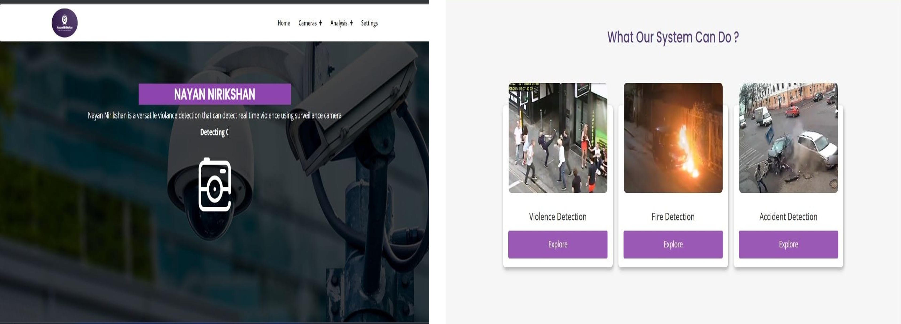
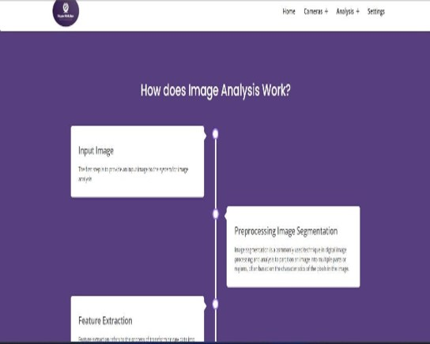
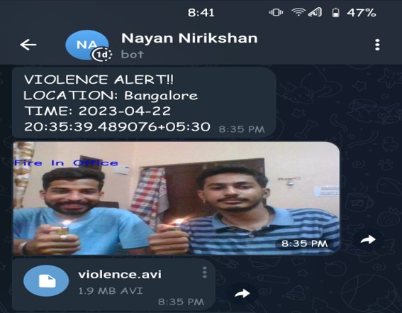

# NAYAN NIRIKSHAN

## Violence Detection System Using Surveillance Camera


## Overview

Nayan Nirikshan is an advanced surveillance system that uses deep learning techniques to detect and recognize different scenes, including violence, car crashes, and fire. The system is designed to enhance security and safety in various environments, such as office buildings, public spaces, and parking lots.

By analyzing real-time video feeds from surveillance cameras, the system can automatically identify potential threats and alert security personnel, reducing response time and improving situational awareness. The system is built using state-of-the-art deep learning models, including CLIP (Contrastive Language-Image Pre-Training) by OpenAI, which enables it to accurately recognize and classify various objects and events.


## Features

- **Real-time Violence Detection**: Monitors live camera feeds to detect violent incidents as they occur
- **Multi-scene Recognition**: Detects various scenarios including:
  - Street violence
  - Office violence
  - Car crashes
  - Fire incidents (both street and office)
- **Alert System**: Sends immediate notifications with images and video clips via Telegram when incidents are detected
- **Multiple Camera Support**: Monitors and analyzes feeds from multiple surveillance cameras simultaneously
- **Video Analysis**: Allows uploading and analyzing pre-recorded videos for violence detection
- **Image Analysis**: Supports uploading and analyzing images for scene classification
- **Configurable Settings**: Customize camera sources, alert timeouts, and notification settings






## Technologies Used

- **Python**: Core programming language
- **Django**: Web framework for the user interface and backend
- **OpenCV**: Computer vision library for video processing
- **CLIP by OpenAI**: Contrastive Language-Image Pre-Training model for scene recognition
- **PyTorch**: Deep learning framework
- **Telepot**: Telegram Bot API for sending alerts
- **NumPy**: Numerical computing library
- **Matplotlib**: Visualization library
- **Pillow**: Image processing library

## System Architecture

The system uses a Vision Transformer (ViT-B/32) model to analyze video frames and classify them into predefined categories. When a violent scene is detected, the system:

1. Captures the frame and saves it as an image
2. Records a video clip of the incident
3. Sends an alert with the image and video to a predefined Telegram chat
4. Displays the detected scene on the web interface

## Installation

### Prerequisites

- Python 3.7 or higher
- Pip package manager
- Webcam or IP camera access
- Telegram Bot Token (optional, for alerts)

### Setup

1. Clone the repository:
   ```
   git clone https://github.com/yourusername/Nayan_Nirikshan.git
   cd Nayan_Nirikshan
   ```

2. Install the required dependencies:
   ```
   pip install -r requirements.txt
   ```

3. Configure your camera sources in the settings page of the web interface

4. Run the Django server:
   ```
   python manage.py runserver
   ```

5. Access the web interface at http://127.0.0.1:8000/index

## Usage

### Web Interface

- **Home**: Overview of the system and project information
- **Cameras**: View and monitor connected camera feeds
  - Camera 1: Primary surveillance feed
  - Camera 2: Secondary surveillance feed
- **Analysis**: Tools for analyzing media
  - Video Analysis: Upload and analyze video files
  - Image Analysis: Upload and analyze images
- **Settings**: Configure camera sources, alert timeouts, and notification settings

### Alert Configuration

To receive Telegram alerts:

1. Create a Telegram bot using BotFather
2. Get your bot token and chat ID
3. Enter these details in the Settings page

## Detection Labels

The system can recognize the following scenes:

### Outdoor Scenarios
- People walking on a street
- Buildings
- Fight on a street
- Fire on a street
- Street violence
- Road
- Car crash
- Cars on a road
- Car parking area
- Cars

### Indoor Scenarios
- Office environment
- Office corridor
- Violence in office
- Fire in office
- People talking
- People walking in office
- Person walking in office
- Group of people

## Research Paper

This project is based on research published at ResearchGate: [NAYAN NIRIKSHAN - Violence Detection Using Surveillance Camera](https://www.researchgate.net/publication/369922789_NAYAN_NIRIKSHAN_-_Violence_Detection_Using_Surveillance_Camera)

## License

This project is licensed under the MIT License - see the LICENSE file for details.

## Acknowledgments

- OpenAI for the CLIP model
- The Django community for the web framework
- OpenCV contributors for the computer vision library

## Contact

For questions or support, please open an issue on the GitHub repository.
